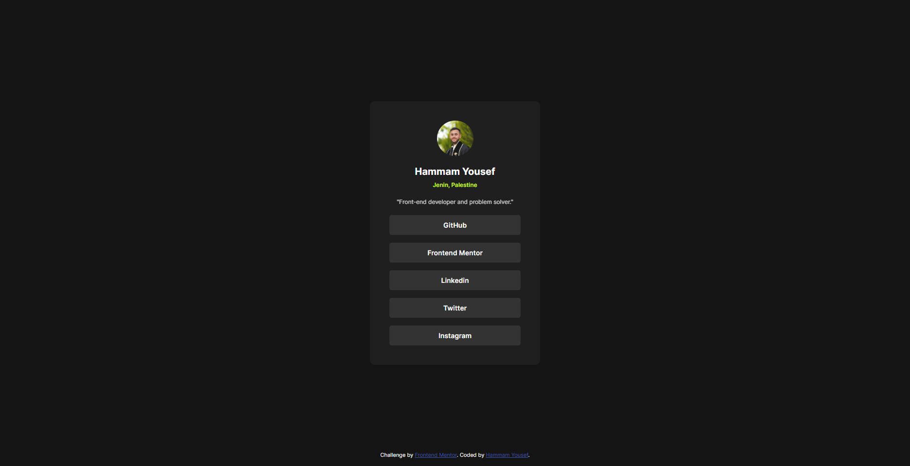

# Frontend Mentor - Social links profile solution

This is a solution to the [Social links profile challenge on Frontend Mentor](https://www.frontendmentor.io/challenges/social-links-profile-UG32l9m6dQ). Frontend Mentor challenges help you improve your coding skills by building realistic projects. 

## Table of contents

- [Overview](#overview)
  - [The challenge](#the-challenge)
  - [Screenshot](#screenshot)
  - [Links](#links)
- [My process](#my-process)
  - [Built with](#built-with)
  - [What I learned](#what-i-learned)
  - [Continued development](#continued-development)
- [Author](#author)
- [Acknowledgments](#acknowledgments)

## Overview

### The challenge

Users should be able to:

- See hover and focus states for all interactive elements on the page

### Screenshot



### Links

- Solution URL: https://github.com/HammamYousef/Social-link-profile
- Live Site URL: https://hammamyousef.github.io/Social-link-profile/

## My process

### Built with

- Semantic HTML5 markup
- CSS custom properties
- Flexbox
- Mobile-first workflow

### What I learned

- How to use CSS custom properties for color theming.
- Responsive design using media queries.
- Styling interactive elements with hover states.
- Using semantic HTML for accessibility.

#### Example code

```html
<a class="link" href="https://github.com/HammamYousef" target="_blank">GitHub</a>
```
```css
.link:hover {
  background-color: var(--green);
  color: var(--grey-900);
  transition: 0.5s;
}
```

### Continued development

- Improve accessibility (focus states, ARIA labels).
- Add more social links or dynamic content.

## Author

- Website - [Hammam Yousef](https://github.com/HammamYousef)
- Frontend Mentor - [@HammamYousef](https://www.frontendmentor.io/profile/HammamYousef)
- LinkedIn - [Hammam Yousef](https://www.linkedin.com/in/hammam-yousef-7029a82a8/)

## Acknowledgments

Thanks to Frontend Mentor for the challenge and the community for inspiration.
